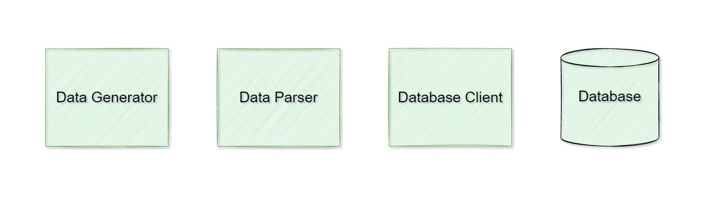
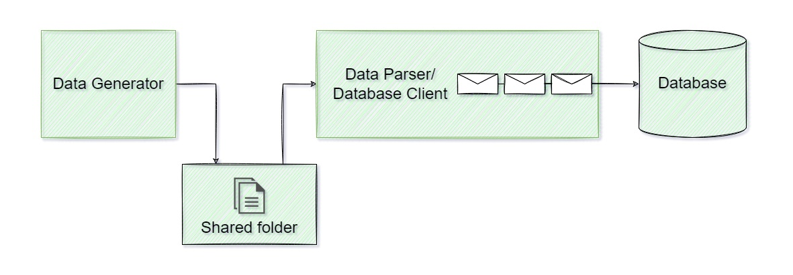
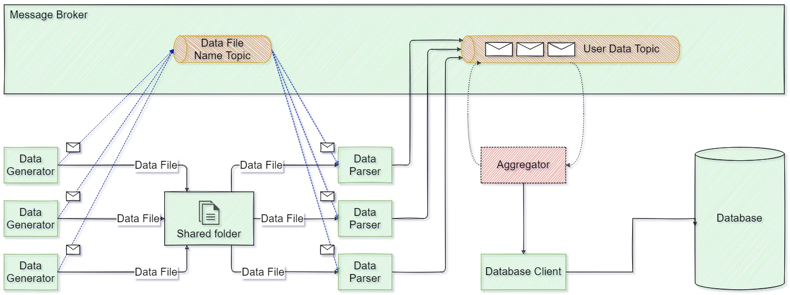

# Data Generator
Этот репозиторий содержит коллекцию возможных вариантов организации компонентов
сервиса, генерирующего постоянный поток данных в виде файлов с детерменированной
структурой записей, а также предоставляющего средства для обработки и последующего
хранения данных в централизованной базе данных. В качестве компонента генерации
данных может выступать как внутренний компонент, так и внешний сервис.

## Входные данные
Имеется сервис, генерирующий поток файлов с данными. Файлы записываются на
диск. Размер файлов сильно варьируется: от десятков мегабайт до нескольких тысяч
мегабайт.
Внутри каждого файла содержатся строки вида "123 12345". Первое число - 
идентификатор потребителя, второе - количество потребленного ресурса. В качестве
разделителя используется пробел.
Поток файлов необходимо обрабатывать, суммируя количество ресурса по каждому
отдельному потребителю. Итоговые данные нужно складывать в центральное
хранилище, увеличивая имеющиеся там значения.

## Задачи
Описать несколько способов надежной и целостной обработки таких потоков
файлов. Текстовое описание каждого способа должно предусматривать:
   * способ передачи файла в инстанс/инстансы программы-обработчика;
   * способ обработки файла внутри программы-обработчика;
   * порядок реакции на неожиданное завершение программы-обработчика
      из-за непредвиденного сбоя.

## Анализ входных данных и выявление требований
1. Компоненты, входящие в состав решения:

   
   В качестве генератора данных может выступать как внутренний компонент,
   так и внешний сервис.
   Компоненты "Парсер" и "Клиент базы данных" могут быть объединены, или
   обособленны.

2. Поскольку размер файлов сильно варьируется, обработка данных должна 
   производиться с контролем использования оперативной памяти, то есть,
   например, используя генераторы в Python, или каналы в Go.

3. Поскольку к сервису предъявляются повышенные требования по надежности
   и отказоустойчивости, необходимо особое внимание уделять следующим 
   областям:
   * Необходимо установить четкое взимодействие между компонентами "Генератор"
     и "Парсер" с целью исключения ситуаций, когда "Парсер" начинает
     обрабатывать файл до момента, когда "Генератор" закончил запись данных
     в этот файл;
   * Компонент "Парсер" должен фиксировать текущее местоположение обработки
     данных, дабы в случае отказа, после перезапуска, продолжить с того же
     места;
   * Компонент "Парсер" должен иметь механизм защиты от повторной обработки уже
     обработанных файлов.

## Возможные причины сбоя
1. Проблемы с хостом, на котором выполняются процессы:
   1. Отказ оборудования (проблемы с "железом", отключение электропитания)
   2. Отказ жесткого диска - например, кончилось свободное пространство.

2. Проблемы с сетью.
   Проблемы с сетью могут возникнуть на различных участках:
   1. между генератором данных и хранилищем файлов,
   2. между хранилищем и парсером,
   3. между парсером и клиентом базы данных, если они реалзованы
      как отдельные процессы,
   4. между клиентом и сервером базы данных.

3. Внештатный останов процесса на любом из хостов.

# Предлагаемые варианты решения
## Прямое пофайловое вычитывание, единственный инстанс каждого компонента
### Компоненты

### Основные преимущества и недостатки
Преимущества:
* Простота имплементации и поддержки по сравнению с распределенными системами.

Недостатки:
* Отсутствие масштабируемости - запуск еще одного процесса может помешать уже
  существующему, если не ввести механизм синхронизации между инстансами;
* Недостаточная отказоустойчивость - если процесс аварийно завершится, обработка
  прекратится;
* Отсутствие параллелизма - одна задача решается в один поток.

###  Генератор
Компонент "Генератор" аккумулирует файлы и сохраняет их на диск в
определенную папку на жестком диске. Генерация происходит в
оперативной памяти и только после полного завершения операции сохраняется
на диск (без возможности дозаписывания в файл), или предварительно во
временной папке с последующим перемещением готового файла в папку назначения,
откуда впоследствии файл будет вычитан компонентом "Парсер".

Процессы компонентов "Генератор" и "Парсер" могут находиться как на одном и
том же хосте, так и на разных.

В первом случае компоненты "Генератор" и "Парсер" могут взаимодействовать
следующими способами:
   1. Компонент "Генератор" сохраняет созданный файл в определенную папку.
      Компонент "Парсер" периодически просматривает эту же папку на предмет появления
      в ней новых файлов. В случае обнаружения новых файлов приступает к чтению.
      Такой способ организации взаимодействия известен как
      <a href="https://en.wikipedia.org/wiki/Polling_(computer_science)" title="polling">Poling</a>.

   2. Компоненты "Генератор" и "Парсер" могут быть связаны между собой при помощи
      <a href="https://ru.wikipedia.org/wiki/%D0%A1%D0%BE%D0%BA%D0%B5%D1%82_%D0%B4%D0%BE%D0%BC%D0%B5%D0%BD%D0%B0_Unix">
      cокета домена UNIX/Internal Process Communication сокета</a>.
      В этом случае компонент "Генератор" после записи сгенерированного файла
      на диск уведомляет компонент "Парсер" о новом файле, после чего последний
      начинает обработку.

   Во втором случае взаимодействие компонентов можно организовать следующими способами:
   1. Папка с файлами данных может быть примонтирована как сетевой диск к хосту,
      на котором выполняется процесс компонента "Парсер".

   2. Компонент "Парсер" может предварительно скачивать файл данных с удаленного ресурса, используя,
      например, протоколы FTP, SCP и т.д.

### Парсер
Компонент "Парсер" отвечает за чтение сгенерированных компонентом "Генератор"
файлов, сбор, преобразование и организацию информации при помощи соответствующих
структур данных и передачу данных в базу данных для хранения, либо в следующий
компонент по цепи взаимодействия.

Компонент "Парсер" может быть организован в виде долгоживущего процесса, который
вычитывает файлы из определенной папки по мере их поступления, либо в виде
консольного приложения, запускаемого по расписанию, при помощи, например
планировщика задач <a href="https://ru.wikipedia.org/wiki/Cron" title="cron">cron</a>.  
В первом случае, возможна регистрация компонента "Парсер" в подсистему инициализации
и управления службами <a href="https://ru.wikipedia.org/wiki/Systemd">systemd</a> 
в Linux. Также, возможна организация системы оповещения об аварийном завершении
процесса компонента.

Принимая во внимание формат хранения данных в файлах:
> Внутри каждого файла содержатся строки вида "123 12345". Первое число - 
идентификатор потребителя, второе - количество потребленного ресурса. В качестве
разделителя используется пробел.

и главную задачу, которую должен выполнять компонент "Парсер":
> Поток файлов необходимо обрабатывать, суммируя количество ресурса по каждому
отдельному потребителю. Итоговые данные нужно складывать в центральное
хранилище, увеличивая имеющиеся там значения.

имеет смысл принять за основную структуру данных накопления пользователем
количества потребленного ресурса 
<a href="https://ru.wikipedia.org/wiki/%D0%A5%D0%B5%D1%88-%D1%82%D0%B0%D0%B1%D0%BB%D0%B8%D1%86%D0%B0">хеш таблицу</a>
(ее реализация в Python - <a href="https://docs.python.org/3/tutorial/datastructures.html#dictionaries">словарь</a>, 
в Go - <a href="https://go.dev/doc/effective_go#maps">Map</a>), так как она
позволяет удобно и эффективно хранить пары "идентификатор пользователя" (ключ) -
"количество потребленного ресурса" (значение).
Также, в целях контроля потребления оперативной памяти процессом, имеет смысл
ввести ограничение на количество пар "ключ"-"значение". По достижении заданного
количества пар "ключ"-"значение" накопленные данные отправляются в следующий по
цепочке компонент, хеш таблица обнуляется и процесс повторяется.
Также, необходимо предусмотреть возможность подбирать конкретное значение 
ограничения под каждый конкретный энвайромент, поэтому имеет смысл предусмотреть
возможность переопределения ограничения путем изменения параметра конфигурационного
файла.

Компонент "Парсер" также должен иметь механизм сохранения своего состояния на случай
аварийного завершения. После перезапуска процесс должен продолжиться с того же места,
на котором закончился в предыдущий раз.

Пример способа реализации такого механизма:
   1. Имя текущего обработанного файла и начальная и конечная обработанные строки в нем
      сохраняются во временный файл:
      > file_name.txt,0,10000

      Сохранение происходит после накопления порции данных и перед ее отправкой в
      следующий компонент.

   2. После успешной отправки снова происходит запись временного файла - начальная
      строка предыдущей записи заменяется на конечную предыдущей записи,
      а коненчная строка новой записи вычисляется по формуле
      > min(<оставшееся_количество_строк_в_файле>, <максимальный_размер_пачки_данных>)

      В случае неуспешной доставки процесс отправки повторяется.

   3. Для покрытия случая, когда порция данных была отослана и сразу после этого, до
      момента получения ответа об успешной доставке данных, процесс аварийно завершился,
      не успев перезаписать временный файл, можно добавить проверку последней транзакции,
      полученной компонентом, которому данные отправляются. В случае базы данных - это
      вычитывание лога изменений данных.

Также, компонент "Парсер" должен иметь механизм защиты от повторной обработки уже
обработанных файлов.
Возможные способы реализации этого механизма:
1. Перемещение обработанных файлов в другую папку с возможной последующей архивацией
   и отправлением в бэкап.
2. Занесение имен обработанных файлов в отдельную базу данных. В этом случае механизм
   сохранения состояния также может быть реализован с использованием этой базы данных.
   База данных может быть локальной, или удаленной.
   Например, простейший способ организации локальной базы данных в языке Python - 
   использование модуля <a href="https://docs.python.org/3/library/sqlite3.html">sqlite3</a>.

В случае, если между компонентом "Парсер" и конечной базой данных нет промежуточных
компонентов, "Парсер" должен реализовывать клиентское приложение для обращения к базе.
Пример для случая, когда конечная база данных поддерживает язык SQL, возможный способ
реализовать передачу данных от "Парсера" до базы данных - использование SQL запроса,
например:

     INSERT INTO table_name
        (id, resource_consumption)
     VALUES 
        (123, 123456),
        ...
        (124, 654321)
     ON DUPLICATE KEY UPDATE resource_consumption = resource_consumption + VALUES(resource_consumption);

##Использование брокера сообщений, множественные инстансы компонентов
###Компоненты

###Основные преимущества и недостатки
Преимущества:
* Масштабируемость - распределенная система позволяет масштабироваться по горизонтали, в том
  числе в реальном времени. К примеру, можно использовать контейнеризацию и, например,
  Kubernetes в качестве оркестратора;
* Отказоустойчивость - если один инстанс компонента аварийно завершился, другие продолжают
  работать;
* Параллелизм - несколько процессоров разделяют одну задачу на части.

Недостатки:
* Более высокая сложность импелементации и поддержки по сравнению с решением с единственными
  инстансами компонентов.

###Брокер сообщений
В качестве 
<a href="https://ru.wikipedia.org/wiki/%D0%91%D1%80%D0%BE%D0%BA%D0%B5%D1%80_%D1%81%D0%BE%D0%BE%D0%B1%D1%89%D0%B5%D0%BD%D0%B8%D0%B9">Брокера сообщений</a>
в данном случае возможно использование <a href="https://ru.wikipedia.org/wiki/Apache_Kafka">Apache Kafka</a>,
либо <a href="https://ru.wikipedia.org/wiki/RabbitMQ">RabbitMQ</a>.

Одна из основных задач брокера - распространение сообщений подписчикам, если используются
шаблоны типа издатель-подписчик.

Внутри брокера заранее созданы специализированные топики
(Топик — это способ группировки потоков сообщений по категориям), производители публикуют 
сообщения определенной категории в топик, а потребители подписываются на этот топик и
читают из него сообщения.

###Генератор
В общем случае, компонент "Генератор" должен обладать теми же свойствами и механизмами,
что были описаны для случая с единственным инстансом.
Смотри раздел ["Генератор для единственного инстанса"](#generator_single_instance).

В случае, когда генератор является внутренним компонентом, взаимодействие с компонентом
"Парсер" возможно организовать следующим образом:
1. Каждый инстанс компонента "Генератор" создает файл данных и сохраняет его на жесткий диск.
   Жесткий диск может представлять из себя централизованное хранилище для всех инстансов
   компонента "Генератор", либо каждому инстансу может быть выделено отдельное хранилище.
   Централизованное хранилище может быть подключено как сетевой диск к каждому из хостов,
   на котором запущен инстанс компонента "Парсер".

   В случае, когда каждому инстансу компонента "Генератор" выделено отдельное хранилище,
   последнее может быть подключено как сетевой диск к одному из хостов, на котором
   выполняется процесс компонента "Парсер", в результате чего последний будет единственным
   инстансом, который имеет доступ к файлам, хранящимся на этом диске.

2. В случае централизованного хранилища для всех инстансов компонентов, "Генератор" может
   опубликовать в соответствующем топике брокера сообщений уведомление о новом файле данных,
   приложив название этого файла (или его полный путь), которое впоследствии будет вычитано
   потребителем в виде одного из инстансов компонента "Парсер".
   Таким образом, вычитавший это сообщение инстанс компонента "Парсер" будет обладать
   уникальным правом на обработку файла, упомянутого в сообщении.

###Парсер
В общем случае, компонент "Парсер" должен обладать теми же свойствами и механизмами,
что были описаны для случая с единственным инстансом.
Смотри раздел ["Парсер для единственного инстанса"](#parser_single_instance).

В случае централизованного хранилища файлов данных, из которого множественные инстансы
компонента "Парсер" вычитывают файлы для обработки, каждый инстанс не начинает обработку
до тех пор, пока не вычитает сообщение, содержащее имя файла, из соответствующего топика
брокера сообщений.

После обработки файла полученные агрегированные данные, упорядоченные с помощью выбранной
структуры данных, порциями загружаются в топик брокера сообщений (отличный от топика,
использовавшегося компонентом "Генератор" для уведомления о появлении нового файла), откуда
они будут вычитываться инстансами клиентов базы данных. Каждое сообщение, загружаемое в
топик, имеет смысл представлять в виде
`"идентификатор_пользователя":"количество_потребленного_ресурса"`, где
"количество_потребленного_ресурса" - аггрегированное в рамках одного файла значение,
соответствующее одному "идентификатору_пользователя".

###Клиент базы данных
В случае, если в качестве брокера сообщений используется Apache Kafka, возможно
использование инструмента
<a href="https://docs.confluent.io/platform/current/connect/index.html">Kafka Connect</a>
с соответствующим коннектором для используемой конечной базы данных. Если функционал
коннектора не позволяет достичь поставленной цели, можно имплементировать
специализированный коннектор.

В противном случае, имплементируется компонент "Клиент базы данных" со следующим
функционалом:
* Вычитывание данных из топика в брокере сообщений;
* Преобразование вычитанных данных в формат, используемый конкретной базой данных;
* Загрузка преобразованных данных в базу данных.

> Замечание: Требуемый в задании способ хранения данных по потреблению ресурса пользователем
  не позволяет эффективно организовать запись в централизованную базу данных в многопоточном
  режиме работы, если количество одновременных транзакций высоко.
  Также, такой способ хранения не позволит получить статистику по потреблению
  ресурса за определенный период времени, если это требуется.  
  Рекомендуемый способ хранения - загружать файлы в предложенном формате построчно с
  указанием времени загрузки каждой записи. Такой способ хранения позволит получать
  статистику за интересующий период времени и за весь срок ведения статистики,тогда как
  описанный в задании способ позволит отображать данные только за весь период ведения
  статистики. Также, предложенный способ хранения позволит получить преимущество по скорости
  обработки файлов данных при наличии множества инстансов компонента "Клиент базы данных".  
  Аггрегированием данных при таком способе хранения может заниматься сторонний сервис,
  например, с Web-ориентированным интерфейсом для предоставления статистики в удобном
  виде.  
  \
  В качестве недостатка предлагаемого способа хранения можно указать необходимость
  хранения большего объема информации. Для устранения этого недостатка предлагается
  организация механизмов по уменьшению гранулярности хранимых данных по достижении
  последними определенного срока хранения.

Механизм загрузки преобразованных данных в базу может различаться в зависимости от типа
конечной базы данных. В общем случае - UPDATE достаточно долгая операция, которая 
подразумевает блокировку строки, а в некоторых случаях, при наличии достаточно многого
количества мелких блокировок - эскалацию блокировки до табличного уровня. Поэтому
необходимо свести к минимуму количество обращений в базу данных. Для этой цели возможно,
например, включить в цепочку дополнительный компонент, целью которого будет аггрегация
данных между файлами:
1. Компонент вычитывает агрегированные в рамках одного файла данные из топика брокера
   сообщений;
2. Агрегирует данные среди всех файлов;
3. В зависимости от количества сообщений и нагрузки на базу данных, компонент записывает
   данные либо в конечную базу данных, либо обратно в топик брокера сообщений,
   где данные по использованию ресурса пользователями опять могут быть просуммированы.
   В последнем случае таких промежуточных компонентов может быть несколько, а
   данные по каждому пользователю могут суммироваться, например, до достижения
   определенного значения;
4. Компонент "Клиент базы данных" записывает данные в базу.
   В зависимости от гранулярности получившихся конечных данных может быть применен
   один из следующих подходов записи данных в базу:
   1. Напрямую через SQL запрос UPDATE;
   2. При помощи временной таблицы, которая впоследствии может быть соединена (MERGE)
      с основной при помощи внутренних механизмов базы данных.

#Заключение
Применение перечисленных здесь, или иных подходов к организации сервиса для подсчета
потребленного каждым пользователем ресурса зависит от следующих факторов:
* Нагруженности сервиса, то есть, объема обрабатываемых данных в единицу времени;
* Требований по масштабируемости и расширяемости решения;
* Требований по детализации предоставляемой статистики;
* Требований по производительности решения;
* Типа конечной базы данных;
* Требований по переиспользованию решения для других подобных нужд и т.д.
